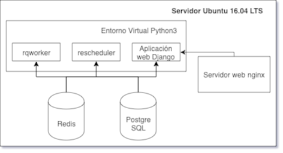

# Arquitectura

La aplicación de monitoreo-apertura está compuesta por un servidor solitario basado en Ubuntu 16.04 LTS que cumple con los siguientes roles:

- Servidor de aplicaciones python
- Servidor web
- Servidor de ejecución de tareas asincrónicas
- Servidor de bases de datos

## Servidor de aplicaciones python

Este rol se implementa por medio de una aplicación `Python3` utilizando el framework web `Django`, instalándose todas las dependencias de la misma en un entorno virtual (`virtualenv`). La aplicación `python` es ejecutada mediante el servicio `gunicorn`.

## Servidor web

El servidor web de la solución se implementa mediante una instalación del servidor web de código abierto `nginx`. La aplicación web se expone en el puerto 80 del servidor web.

## Servidor de ejecución de tareas asincrónicas

Las tareas asincrónicas utilizan las mismas dependencias de la aplicación web `Django`, pero se ejecuta como dos servicios distintos, basados en `django-rq`:

- `rqworker`: Uno o más procesos enncargados de la ejecución de las tareas asincrónicas solicitadas por la aplicación web `Django`.
- `rqscheduler`: Este componente se encarga de disparar las tareas programadas periódicamente.

Ambos servicios son utlizan el mismo entorno de ejecución, entorno virtual (`virtualenv`) y la configuración de la aplicación `Django`.

## Servidor de bases de datos

El rol de servidor de bases de datos es implementado mediante la configuración de dos motores de bases de datos:

- PostgreSQL 9.6: Base de datos relacional. Utilizada por la aplicación Django para guardar la información del modelo de la aplicación.
- Redis: Servidor de base de datos en memoria utilizado como administrador de mensajes para el sistema de ejecución de tareas asincrónicas.

## Diagrama de arquitectura

