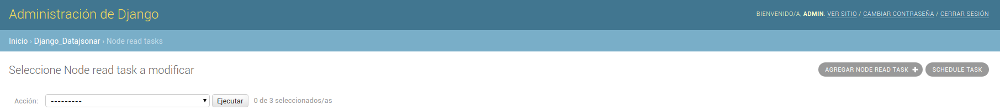
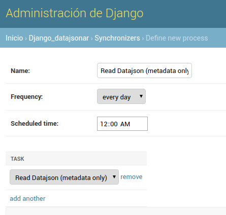
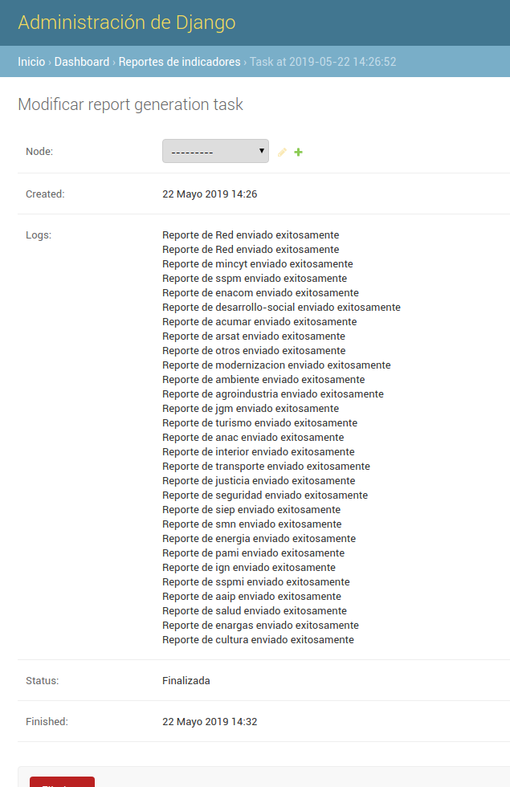
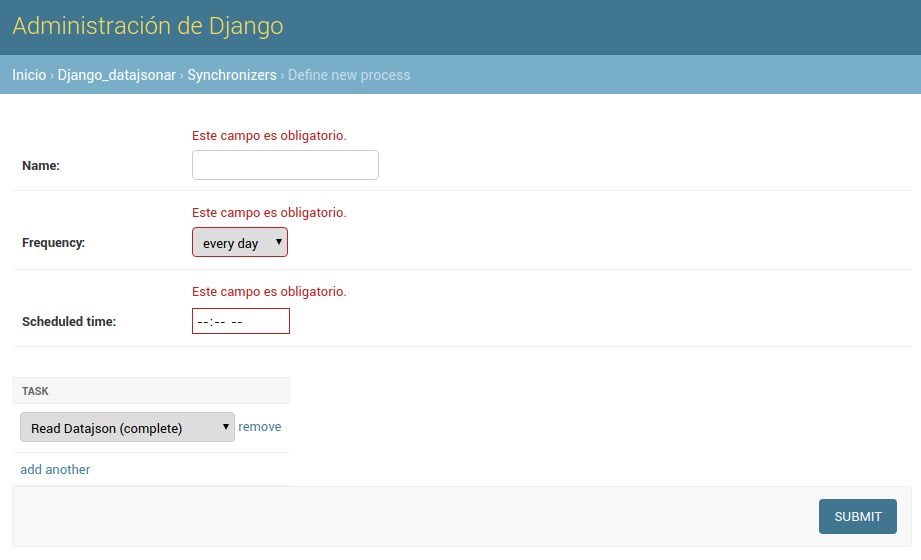
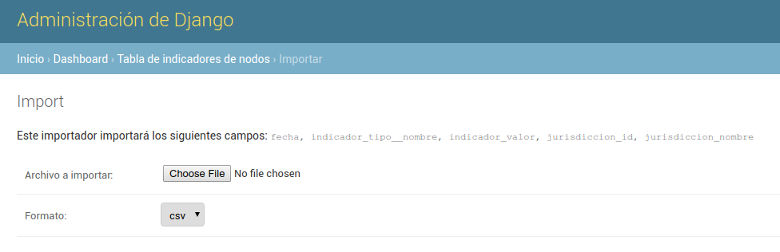

<!-- START doctoc generated TOC please keep comment here to allow auto update -->
<!-- DON'T EDIT THIS SECTION, INSTEAD RE-RUN doctoc TO UPDATE -->
## Indice

- [Uso](#uso)
  - [Carga de Nodos](#carga-de-nodos)
    - [Configuración de datasets indexables](#configuraci%C3%B3n-de-datasets-indexables)
    - [Generación de archivos de configuración](#generaci%C3%B3n-de-archivos-de-configuraci%C3%B3n)
  - [Lectura de catalogos](#lectura-de-catalogos)
    - [Lectura periodica](#lectura-periodica)
  - [Generación de indicadores](#generaci%C3%B3n-de-indicadores)
    - [Reporte de indicadores](#reporte-de-indicadores)
  - [Creación de procesos](#creaci%C3%B3n-de-procesos)
  - [Series de tiempo](#series-de-tiempo)
  - [Importar/Exportar indicadores](#importarexportar-indicadores)
  - [Modificar timezone de un Nodo Federador](#modificar-timezone-de-un-nodo-federador)

<!-- END doctoc generated TOC please keep comment here to allow auto update -->

# Uso

## Carga de Nodos

Despues de iniciar sesion como Administrador, debemos cargar un nuevo `Node Register file`.
Esta pagina se encuentra en la ruta `/admin/django_datajsonar/noderegisterfile/`.
Este archivo tiene un registro de los nodos _a federar_. Ese un archivo de extencion `.yml` y
tiene un aspecto como el siguiente:


```yaml
datosgobar:
  url: "http://datos.gob.ar/data.json"
  formato: "json"
  federado: false

transporte-bis:
  url: "http://datos.transporte.gob.ar/data.json"
  formato: "json"
  federado: false

# Mas nodos...
```

Luego de que creamos la nueva instancia, volvemos a la pagina del listado y deberiamos ver algo como 
la siguiente imagen:


Luego seleccionamos la instancia y usamos la accion "Process node file", como se muestra en la imagen:


Eso procesara el archivo (puede tardar un poco), y al terminar veremos los nodos detectados en
`/admin/django_datajsonar/node/`, algo parecido a


### Configuración de datasets indexables

Hay 2 formas de marcar un nodo como indexable, manualmente o cargando un csv de configuración. Para el caso manual, se
puede marcar en el modelo, o marcar un subconjunto de los datasets y ejecutar la acción "Marcar como indexable".

El otro método es cargando un nuevo `Dataset Indexing file`. Esta pagina se encuentra en la ruta
`/admin/django_datajsonar/datasetindexingfile/`. El archivo tiene un registro de los datasets _indexables_.
Es un archivo de extensión `.csv` y tiene un aspecto como el siguiente:


```
catalog_id,dataset_identifier
sspm,399
sspm,330
enacom,REGIS-DE-PROVE-POSTA
acumar,cb351aa5-731b-458b-8227-a0c5b828356f
# Más entradas
```

La primera columna tiene el identificador del catálogo, y la segunda el identificador del dataset que se desea marcar
como indexable.

Luego de que creamos la nueva instancia, volvemos a la página del listado y deberíamos ver algo como
la siguiente imagen:


Luego seleccionamos la instancia y usamos la acción "Process node file", como se muestra en la imagen:


Eso procesa el archivo (puede tardar un poco), y al terminar veremos los datasets marcados como indexables en
`/admin/django_datajsonar/node/`.

### Generación de archivos de configuración

Hay 2 formas de generar los archivos de configuración con los datasets indexables. La primera es entrando en la ruta:
`admin/dataset/federacion-config.csv`. De esa manera, se descarga un csv con todos datasets marcados como indexables.

La segunda es mediante una acción de Django. Podemos seleccionar un subconjunto de datasets y ejecutar la acción
`Generar csv de configuración`


De esta manera conseguimos el csv de configuración con los datasets indexables del subconjunto elegido.

## Lectura de catalogos

Para lanzar una lectura de todos los catalogos de los nodos, podemos instancia una `ReadDataJsonTask`.
Para eso nos dirigimos a la ruta `/admin/django_datajsonar/readdatajsontask/`.
Esta instancia no requiere ningun parametro, ya que leera los datos necesarios de las instancias `Node`
del proceso anterior.
Esta instancia ira registrando los "logs" y "resultados" del proceso. Podremos ver algo como:


### Lectura periodica 

Para que la lectura de los catalogos se ejecute periodicamente, debemos crear un `Synchronizer`.

En la vista de lista de `Read Node Tasks` podemos crear un nuevo synchronizer. Accediendo en la opción
`schedule task`.



Antes de guardar la instancia deberiamos tener algo como:



En los campos del form podemos definir el horario a correr, los días y el nombre del synchronizer.

## Generación de indicadores

Hay 2 formas de comenzar una corrida de generación de indicadores de la red de nodos: podemos instanciar una
Corrida de indicadores. Para eso nos dirigimos a la ruta `/admin/dashboard/indicatorsgenerationtask/`.
Esta instancia no requiere ningun parametro, lee los catálogos a partir de la librería de Github.
Estas instancias registran los "logs" y "resultados" del proceso. Podremos ver algo como:


La otra forma es mediante un management command de Django. El comando `python manage.py indicadores` dispara de manera
sincrónica una tarea de generación de indicadores. De la misma manera que el anterior, el resultado se guarda en los
logs del `IndicatorsGenerationTask` correspondiente.


### Reporte de indicadores

Los mails de reporte de red se envian al staff del proyecto. Para marcar un usuario como staff, hay que acceder
a la ruta `/admin/auth/user/` y en la vista del usuario particular, marcar la opción:


Es posible correr manualmente un proceso de envío de reportes instanciando un modelo de Django.
Para eso nos dirigimos a la ruta `/admin/dashboard/indicatorsgenerationtask/`.
Esta instancia no requiere ningun parámetro, lee los indicadores calculados en la última corrida de indicadores.
Estas instancias registran los "logs" y "resultados" del proceso. Podremos ver algo como:




## Creación de procesos

Es posible, crear procesos que engloben las tareas descriptas anteriormente y las ejecuten secuencialmente.
Para lograr eso vamos a la ruta `/admin/django_datajsonar/synchronizer/`. Allí vamos a `Agregar synchronizer` y nos
encontramos con un formulario de este estilo:



El campo **name** identifica al synchronizer, **frequency** determina los días cuando se correrán los procesos.
Finalmente, **scheduled time** indica la hora a correr la primer etapa del synchronizer.

Cada fila del campo task representa una etapa, y se ejecutan en orden siendo la de arriba la primera. Actualmente, para
configurar las tareas ya existentes, se pueden pasar los siguientes procesos:

    - Read Datajson (complete)
    - Read Datajson (metadata only)
    - Federation
    - Indicators
    - Indicators reports
    - Validation reports


## Series de tiempo

Es posible descargar los indicadores como series de tiempo en formato `.csv`. Entrando en la ruta
`admin/dashboard/indicadorred/series-indicadores` podemos descargar las series de los indicadores agregados; y en la ruta
`admin/dashboard/indicador/<id de nodo>/series-indicadores` se encuentran las series para nodos particulares.

Se pueden definir en el admin de tipos de indicadores cuales se desean mostrar en las series. Marcando los booleanos,
`series red` y `series nodos` se especifican los tipos a presentar.

## Importar/Exportar indicadores

Se pueden bajar la base de indicadores e indicadores de red mediante el management command: `/manage.py export_indicators [file] [--aggregated]`.
El argumento `file` es un path al archivo donde se van a escribir los indicadores. El parametro opcional `--aggregated` indica si se trata de
indicadores red, por default se asume indicadores de nodos.

A su vez es posible importar a la base de indicadores mediante el management command `/manage.py import_indicators [file] [--aggregated]`
Los parámetros `file` y `--aggregated` indican lo mismo que para el comando anterior. Se espera un csv válido con la forma:
`fecha, indicador_tipo, indicador_valor [, jurisdiccion_id, jurisdiccion_nombre]` para indicadores de red y de nodos
respectivamente. La operación es un upsert, es decir se actualizaran los valores en caso que ya existen y se crearan
indicadores nuevos si estos no están presentes.

Alternativamente, se puede importar mediante UI un csv con los indicadores (**Importante**: el csv debe tener la misma forma
que el descripto por el punto anterior). Desde la vista de lista de la tabla de indicadores correspondientes, se ingresa
con el botón importar. Debería caer al siguiente form:



El primer campo toma el archivo de csv a subir; el segundo, el formato del archivo. Actualmente, el único formato que
acepta es csv.

Además, accediendo a las siguientes rutas, se pueden descargar los siguientes dumps:

- `/indicadores-red.csv`: descarga un dump de la base de indicadores de red
en formato.csv
- `/indicadores-nodo.csv`: descarga un dump de los indicadores de nodos
- `/indicadores-federadores.csv`: descarga un dump de los indicadores federadores
- `/nodos.json`: devuelve (no descarga) la información de todos los nodos (id y nombre de los nodos,
nombre de jurisdicción, urls de descarga de datos, etc). Se puede descargar esta información en
formato **csv** o **xlsx** accediendo a `/nodos.csv` o `/nodos.xlsx` respectivamente
- `/nodes.json`: idem al url anterior, pero con los datos en inglés. También se pueden descargar
en formatos **csv** o **xlsx** cambiando la extension de archivo en el url
-  `/distribuciones.csv`: descarga un dump con toda la información de las distribuciones
- `/admin/django_datajsonar/dataset/federacion-config.csv`: descarga un dump con los identificadores
de los DataSets y la id del catálogo al que pertenecen
- `/admin/dashboard/indicadorred/series-indicadores`:  descarga un archivo csv con información sobre
todos los datasets

## Modificar timezone de un Nodo Federador
Es posible modificar el timezone de un nodo federador si así se deseara o en caso de que sea necesario. Para esto,
simplemente cambiamos el campo **Timezone** cuando creamos un nuevo nodo federador en `/admin/dashboard/harvestingnode/add/`.
Por defecto, el timezone es 'America/Buenos_Aires'. [Aquí](https://en.wikipedia.org/wiki/List_of_tz_database_time_zones#List)
se puede consultar una lista completa de los timezones que pueden usarse (columna *TZ database name*).
