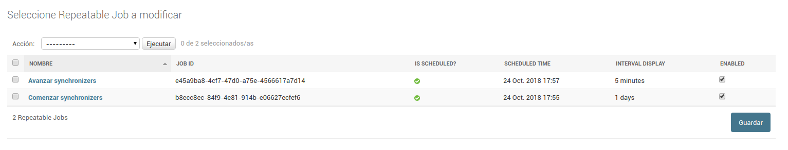

# Uso

## Carga de Nodos

Despues de iniciar sesion como Administrador, debemos cargar un nuevo `Node Register file`.
Esta pagina se encuentra en la ruta `/admin/django_datajsonar/noderegisterfile/`.
Este archivo tiene un registro de los nodos _a federar_. Ese un archivo de extencion `.yml` y
tiene un aspecto como el siguiente:


```yaml
datosgobar:
  url: "http://datos.gob.ar/data.json"
  formato: "json"
  federado: false

transporte-bis:
  url: "http://datos.transporte.gob.ar/data.json"
  formato: "json"
  federado: false

# Mas nodos...
```

Luego de que creamos la nueva instancia, volvemos a la pagina del listado y deberiamos ver algo como 
la siguiente imagen:


Luego seleccionamos la instancia y usamos la accion "Process node file", como se muestra en la imagen:


Eso procesara el archivo (puede tardar un poco), y al terminar veremos los nodos detectados en
`/admin/django_datajsonar/node/`, algo parecido a


### Configuración de datasets indexables

Hay 2 formas de marcar un nodo como indexable, manualmente o cargando un csv de configuración. Para el caso manual, se
puede marcar en el modelo o, marcar un subconjunto de los datasets y ejecutar la acción "Marcar como indexable".

El otro método es cargando un nuevo `Dataset Indexing file`.
Esta pagina se encuentra en la ruta `/admin/django_datajsonar/datasetindexingfile/`.
Este archivo tiene un registro de los datasets _indexables_. Ese un archivo de extencion `.csv` y
tiene un aspecto como el siguiente:


```
catalog_id,dataset_identifier
sspm,399
sspm,330
enacom,REGIS-DE-PROVE-POSTA
acumar,cb351aa5-731b-458b-8227-a0c5b828356f
# Más entradas
```

La primera columna tiene el identificador del catalogo, y la segunda el identificador del dataset que se desea marcar
como indexable.

Luego de que creamos la nueva instancia, volvemos a la pagina del listado y deberiamos ver algo como
la siguiente imagen:


Luego seleccionamos la instancia y usamos la accion "Process node file", como se muestra en la imagen:


Eso procesa el archivo (puede tardar un poco), y al terminar veremos los datasets marcados como indexables en
`/admin/django_datajsonar/node/`.

### Generación de archivos de configuración

Hay 2 formas de generar los archivos de configuración con los datasets indexables. La primera es entrando en la ruta:
`admin/dataset/federacion-config.csv`. De esa manera, se descarga un csv con todos datasets marcados como indexables.

La segunda es mediante una acción de Django. Podemos seleccionar un subconjunto de datasets y ejecutar la acción
`Generar csv de configuración`


De esta manera conseguimos el csv de configuración con los datasets indexables del subconjunto elegido.


## Lectura de catalogos

Para lanzar una lectura de todos los catalogos de los nodos, podemos instancia una `ReadDataJsonTask`.
Para eso nos dirigimos a la ruta `/admin/django_datajsonar/readdatajsontask/`.
Esta instancia no requiere ningun parametro, ya que leera los datos necesarios de las instancias `Node`
del proceso anterior.
Esta instancia ira registrando los "logs" y "resultados" del proceso. Podremos ver algo como:


### Cierre de la tarea

Por una cuestion de concurrencia, las tareas no quedaran en estado "Finalizada" por si solas.
Para que el sistema verifique es estado de las tareas, debemos instanciar un `RepeatableJob`.
Para eso vamos a la ruta `/admin/scheduler/repeatablejob/`.

- En el campo **nombre** podemos poner lo que deseemos (como "Cerrar lecturas de red").
- En el campo **callable** debemos poner `django_datajsonar.indexing.tasks.close_read_datajson_task`.
- En el campo **Queue** ponemos `indexing`.
- En los campos **fecha** y **hora** de **scheduled time** hacemos click en "Hoy" y "Ahora".
- Finalmente en **interval** ponemos `10` y en **interval unit** `minutes`.

Luego de guardar la instancia deberiamos tener algo como:


### Lectura periodica 

Para que la lectura de los catalogos se ejecute periodicamente, debemos crear un `RepeatableJob`.

Para eso vamos a la ruta `/admin/scheduler/repeatablejob/`.

- En el campo **nombre** podemos poner lo que deseemos (como "New Read Datajson Task").
- En el campo **callable** debemos poner `django_datajsonar.tasks.schedule_new_read_datajson_task`.
- En el campo **Queue** ponemos `indexing`.
- Habilitar el campo **Enabled**.
- En los campos **fecha** y **hora** de **scheduled time** hacemos click en "Hoy" y "Ahora".
- Finalmente en **interval** ponemos `1` y en **interval unit** `days`.

Luego de guardar la instancia deberiamos tener algo como:


## Generación de indicadores

Hay 2 formas de comenzar una corrida de generación de indicadores de la red de nodos: podemos instanciar una
Corrida de indicadores. Para eso nos dirigimos a la ruta `/admin/dashboard/indicatorsgenerationtask/`.
Esta instancia no requiere ningun parametro, lee los catálogos a partir de la librería de Github.
Estas instancias registran los "logs" y "resultados" del proceso. Podremos ver algo como:


La otra forma es mediante un management command de Django. El comando `python manage.py indicadores` dispara de manera
sincrónica una tarea de generación de indicadores. De la misma manera que el anterior, el resultado se guarda en los
logs del `IndicatorsGenerationTask` correspondiente.

### Generación periódica 

Para que la lectura de los catalogos se ejecute periodicamente, debemos crear un `RepeatableJob`.

Para eso vamos a la ruta `/admin/scheduler/repeatablejob/`.

- En el campo **nombre** podemos poner lo que deseemos (como "Generación indicadores").
- En el campo **callable** debemos poner `monitoreo.apps.dashboard.indicators_tasks.indicators_run`.
- En el campo **Queue** ponemos `indicators`.
- Habilitar el campo **Enabled**.
- En los campos **fecha** y **hora** de **scheduled time** hacemos click en "Hoy" y "Ahora".
- Finalmente en **interval** ponemos `1` y en **interval unit** `days`.

Luego de guardar la instancia deberiamos tener algo como:


### Reporte de indicadores

Es posible programar una tarea para enviar un reporte de los indicadores de la red de nodos a los responsables
pertinentes. Se hace también con un `RepeatableJob`.

En la ruta `/admin/scheduler/repeatablejob/`.

- En el campo **nombre** podemos poner lo que deseemos (como "Reporte indicadores").
- En el campo **callable** debemos poner `monitoreo.apps.dashboard.report_tasks.send_reports`.
- En el campo **Queue** ponemos `reports`.
- Habilitar el campo **Enabled**.
- En los campos **fecha** y **hora** de **scheduled time** hacemos click en "Hoy" y "Ahora".
- Finalmente en **interval** ponemos `1` y en **interval unit** `days`.


Luego de guardar la instancia deberiamos tener algo como:


Los mails de reporte de red se envian al staff del proyecto. Para marcar un usuario como staff, hay que acceder
a la ruta `/admin/auth/user/` y en la vista del usuario particular, marcar la opción:


## Creación de procesos

Es posible, crear procesos que engloben las tareas descriptas anteriormente y las ejecuten secuencialmente.
Para lograr eso vamos a la ruta `/admin/django_datajsonar/synchronizer/`. Allí vamos a `Create new process` y nos
encontramos con un formulario de este estilo:


En el primer campo ponemos el nombre del proceso y en el segundo la cantidad de etapas que tendrá. Al dar submit,
nos encontramos con la segunda parte del formulario:


Cada fila representa una etapa, y se ejecutan en orden siendo la de arriba la primera. Actualmente para configurar las
tareas ya existentes se deben pasar estos valores:

| Tarea                                  | Callable Str                                             | Queue      | Task                     |
|----------------------------------------|----------------------------------------------------------|------------|--------------------------|
| Lectura de la red de nodos (default)   | django_datajsonar.tasks.schedule_new_read_datajson_task  | indexing   | ReadDataJsonTask         |
| Lectura de la red de nodos (completa)  | django_datajsonar.tasks.schedule_full_read_task          | indexing   | ReadDataJsonTask         |
| Lectura de la red de nodos (metadatos) | django_datajsonar.tasks.schedule_metadata_read_task      | indexing   | ReadDataJsonTask         |
| Federación de metadatos                | monitoreo.apps.dashboard.tasks.federation_run            | federation | FederationTask           |
| Cálculo de indicadores                 | monitoreo.apps.dashboard.indicators_tasks.indicators_run | indicators | IndicatorsGenerationTask |
| Envío de reportes                      | monitoreo.apps.dashboard.report_tasks.send_reports       | reports    | ReportGenerationTask     |

Si no están creadas, es necesario schedulear 2 tareas de mantenimiento periódicas. Se crean mediante repeatableJobs:

En la ruta `/admin/scheduler/repeatablejob/`.

Primero vamos a crear la tarea que comienza los procesos en stand-by.

- En el campo **nombre** podemos poner lo que deseemos (como "Comenzar synchronizers").
- En el campo **callable** debemos poner `django_datajsonar.synchronizer_tasks.start_synchros`.
- En el campo **Queue** ponemos `synchro`.
- Habilitar el campo **Enabled**.
- En los campos **fecha** y **hora** de **scheduled time** hacemos click en "Hoy" y "Ahora".
- Finalmente en **interval** ponemos `1` y en **interval unit** `days`.

Luego de guardar la instancia deberiamos tener algo como:


La siguiente es la tarea que avanza las tareas a medida que van terminando:

- En el campo **nombre** podemos poner lo que deseemos (como "Avanzar synchronizers").
- En el campo **callable** debemos poner `django_datajsonar.synchronizer_tasks.upkeep`.
- En el campo **Queue** ponemos `synchro`.
- Habilitar el campo **Enabled**.
- En los campos **fecha** y **hora** de **scheduled time** hacemos click en "Hoy" y "Ahora".
- Finalmente en **interval** ponemos `5` y en **interval unit** `minutes`.

Luego de guardar la instancia deberiamos tener algo como:



